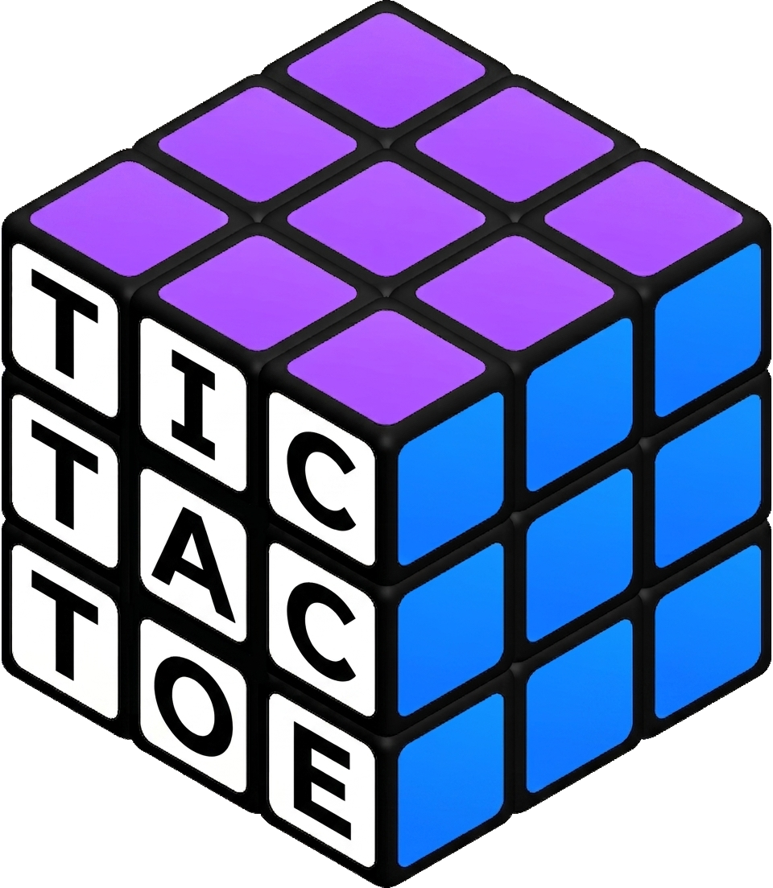

  
  <h1>Rubik Tac Toe</h1>

  **[Try it on keegant.dev →](https://keegant.dev)**

---

A real-time two-player game with two modes: Classic 3x3 grid, and a 3D twist that plays across the six faces of a Rubik's Cube.

## Features

- Two game modes - Classic and Cube
- Real-time multiplayer over WebSockets
- Shareable room links - send the URL to invite a friend
- Reconnect support - leave and rejoin a room within 60 seconds without losing your spot
- Server-authoritative game logic - all moves are validated server-side
- Drag to rotate the cube in 3D

## How Cube Mode Works

Each face of the cube is a 3x3 board, but moves are shared across face boundaries - placing on a corner, edge, or center marks cells on multiple faces simultaneously.

| Move type | Faces affected   |
|-----------|------------------|
| Corner    | 3 faces          |
| Edge      | 2 faces          |
| Center    | 2 opposite faces |

Get three in a row on a face to **claim** it. Claimed faces are locked for the rest of the game. **First to claim 4 faces wins.**

A few extra rules:
- X always goes first, but cannot open on a corner
- A single move can claim multiple faces at once
- If a face fills up with no winner, it's a draw and goes inactive
